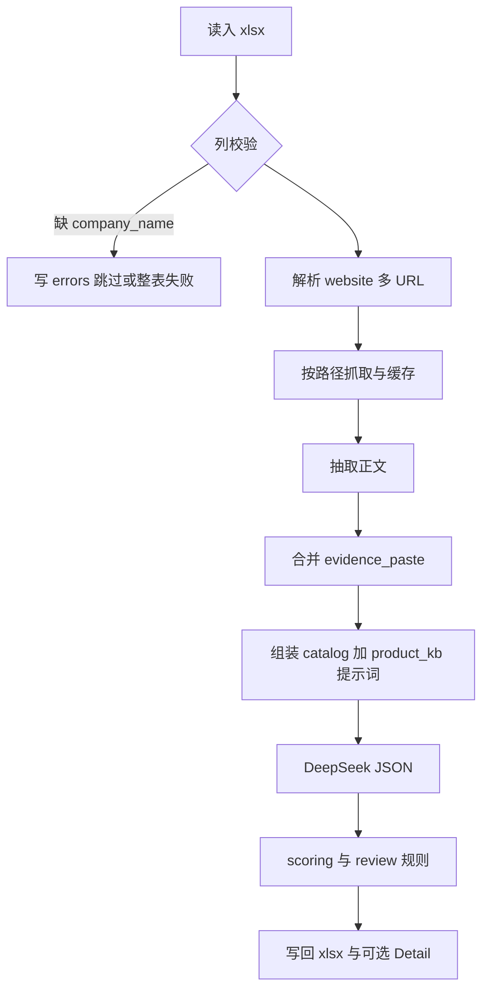

# 技术栈与实现路线（对齐 PRD）

**文档版本**：1.0  
**配套**：[PRD.md](./PRD.md)

---

## 1. 技术栈（MVP 冻结）

| 层级 | 选型 | 说明 |
|------|------|------|
| 语言 | Python 3.11+（建议） | 与现有 `tools/` 一致 |
| Excel | `pandas` + `openpyxl` | 读写 `.xlsx`；条件格式用于复核行标红（可选） |
| HTTP 抓取 | `httpx` | 异步可选；同步 MVP 即可；超时、重试、限流 |
| 正文抽取 | `trafilatura`（首选） | 失败时可降级为极简 HTML strip（实现内兜底） |
| LLM | **DeepSeek**（OpenAI 兼容） | 复用 [tools/deepseek_client.py](../tools/deepseek_client.py)；`response_format=json_object` |
| JSON | 标准库 `json` + 可选 `json-repair` 或重试 | 解析失败时有限次重试或降级空结构并写 `errors` |
| 配置 | 环境变量 + 可选 `yaml`/`json` 配置文件 | API Key、模型名、权重、阈值 |
| 缓存 | 本地目录 `cache/`（gitignore） | 按 URL hash 存原文或抽取文本，便于抽查 |

**明确不引入（MVP）**

- FastAPI / Celery / Redis  
- Playwright（可作为 Phase 2 可选项写入 Backlog）  
- 任意商业搜索 SDK  

---

## 2. 仓库目标结构（实现时按此落地）

```text
d:\creat_agent\
  docs\
    PRD.md                 # 需求与验收（本仓库权威）
    TECH_ROADMAP.md        # 本文
  schemas\
    eval_result.schema.json   # LLM 输出 JSON Schema
    excel_io.json              # 列约定与默认权重/复核规则元数据
  product_kb\
    v1\
      kb.json                  # 我方话术、负面清单、目标客群等（版本化）
  tools\
    deepseek_client.py         # 已有
    build_product_catalog.py   # 已有 → output/catalog.json
    eval_company_fit.py        # 可演进为「单行评估」或与新 CLI 共享 prompt
    pipeline/                  # 新增建议
      __init__.py
      io_excel.py              # 读模板、写结果、列校验
      fetch_cache.py           # 抓取 + 缓存 + 重试
      evidence.py              # 合并抓取文本与 evidence_paste
      scoring.py               # overall_score_computed、manual_review_flag
      llm_eval.py              # 组装 messages、调用 chat_json、校验字段
  run_customer_pipeline.py     # 或 tools/run_customer_pipeline.py：CLI 入口
  requirements.txt             # 追加 httpx、trafilatura 等
  .gitignore                   # 忽略 cache/、.env
```

实现允许微调文件名，但**职责边界**应与上表一致，并在 PRD 验收项下可测。

---

## 3. 流水线（逻辑顺序）



**抓取路径建议（实现常量）**

- 首页 + `/about`、`/about-us`、`/products`、`/contact`、`/company` 等（可配置列表）  
- 单公司总字符上限，避免撑爆 context  

**失败**  

- 全部 URL 失败：不调用搜索 API；`errors` 记录原因；`data_quality=low`  
- 若 `evidence_paste` 非空：仍将粘贴块送入模型，并在 `citations` 中区分来源  

---

## 4. LLM 契约（与 schema 对齐）

- 输出必须为单一 JSON 对象，字段与 [schemas/eval_result.schema.json](../schemas/eval_result.schema.json) 一致（实现阶段若文件尚未创建，以 PRD 第 4 节字段为准先写 schema 再写代码）。  
- **不得**由模型输出最终 `overall_score_computed`（或同名字段仅作参考时可命名 `overall_score_model_hint` 可选）；**对外统一使用程序计算值**。  
- `citations[]`：`claim`、`source_url`、`source_snippet`；来自 `evidence_paste` 的条目须在 `claim` 或 snippet 中可辨认为用户粘贴。  
- `data_quality`：模型对「证据是否足以支撑结论」的自评；程序可结合抓取结果做**上限封顶**（例如无抓取成功且粘贴很短 → 不高于 `medium`）。

---

## 5. 分阶段交付（建议 Sprint）

| 阶段 | 内容 | 产出 |
|------|------|------|
| P0 | `schemas/` + `product_kb/v1/kb.json` + 输入输出列在代码中常量与校验 | 可静态审查 |
| P1 | `fetch_cache` + `evidence` + CLI 骨架；无 LLM 时 dry-run 写 `errors`/`fetched_pages` | 可测抓取 |
| P2 | `llm_eval` 接 DeepSeek；写回主表列 + `eval_json` | 端到端 10 行样例 |
| P3 | `scoring`、复核标志、openpyxl 条件格式（可选） | 满足 PRD 验收 5–6 |
| P4 | 第二 Sheet `Detail`、日志与配置外置 | 便于生产使用 |

---

## 6. 环境变量（与现有代码对齐）

| 变量 | 必填 | 说明 |
|------|------|------|
| `DEEPSEEK_API_KEY` | 是 | |
| `DEEPSEEK_MODEL` | 否 | 默认见 `deepseek_client.py` |
| `DEEPSEEK_BASE_URL` | 否 | 默认官方兼容地址 |

可选：`CATALOG_PATH`、`PRODUCT_KB_PATH`、`CACHE_DIR`、`PIPELINE_CONFIG_PATH`。

---

## 7. 与现有脚本的关系

- **`build_product_catalog.py`**：继续作为 `output/catalog.json` 的唯一生成入口；流水线读取 `catalog_version` 写入提示词或输出列。  
- **`eval_company_fit.py`**：逻辑合并到 `pipeline/llm_eval.py` 或由其调用，避免两套 prompt 漂移；CLI 以 `run_customer_pipeline` 为主入口。  

---

## 8. 修订记录

| 版本 | 日期 | 说明 |
|------|------|------|
| 1.0 | 2026-05-07 | 首版：对齐 CLI、DeepSeek、evidence_paste、无自动搜索 |
